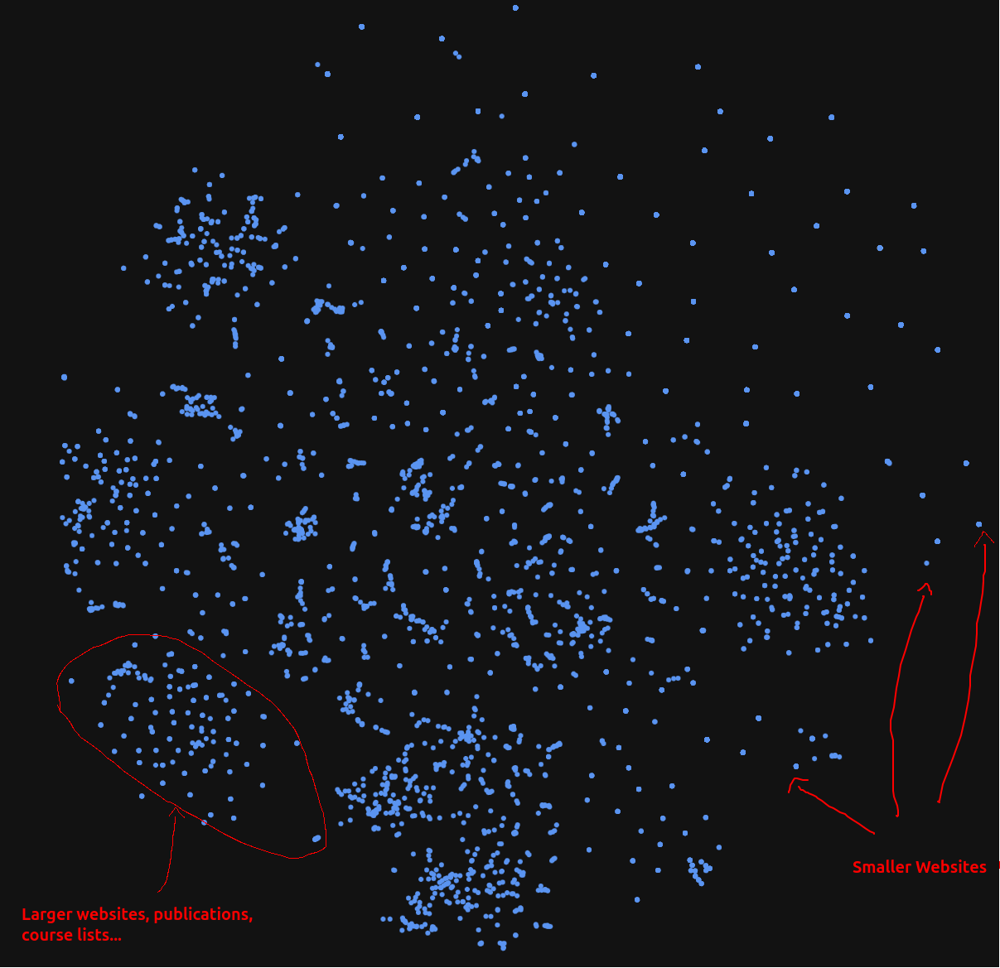

# UofT-Webcrawler

<p>This project aims to crawl UofT websites, and vector embed chunks of text using Qdrant. The project will have a web user interface and a REST API allowing users to search the database for relevant information. (eg: user searches "Bayesian Networks" and gets classes and programs related to Bayesian Networks).</p>
<p>The project operates with a microservices architecture, with packages Dockerized and orchestrated with Docker Compose. All commands are handled with GNU Make.</p>

## Qdrant Database visualization 


## 📁 Project Structure

```
UofT-Webcrawler/
├── docker-compose.yml          # Orchestrates all services
├── Makefile                    # Build and deployment commands
├── README.md                   # Project documentation
├── go.mod                      # Go module dependencies
├── go.sum                      # Go module checksums
├── packages/
│   ├── qdrant-interactor/      # Python FastAPI service for Qdrant operations
│   │   ├── Dockerfile          # Container configuration
│   │   ├── main.py             # FastAPI application entry point
│   │   ├── embedding_agent.py  # Qdrant client and vector operations
│   │   ├── requirements.txt    # Python dependencies
│   │   └── schemas/            # Pydantic models for API requests/responses
│   │       ├── QueryRequest.py
│   │       ├── QueryResponse.py
│   │       └── TextEmbeddingRequest.py
│   ├── chatbot/                # Python FastAPI service for LLM-powered chatbot
│   │   ├── Dockerfile          # Container configuration
│   │   ├── main.py             # FastAPI application entry point
│   │   ├── chatbot.py          # LangChain-based chatbot with RAG
│   │   └── requirements.txt    # Python dependencies
│   ├── web-client/             # React TypeScript frontend application
│   │   ├── Dockerfile          # Container configuration
│   │   ├── package.json        # Node.js dependencies
│   │   ├── vite.config.ts      # Vite build configuration
│   │   ├── index.html          # HTML entry point
│   │   └── src/                # React application source code
│   │       ├── App.tsx         # Main application component
│   │       ├── components/     # React components
│   │       │   ├── Message.tsx
│   │       │   └── Messages.tsx
│   │       └── schemas/        # TypeScript type definitions
│   │           └── Message.ts
│   └── web-crawler/            # Go-based web crawler service
│       └── main.go             # Web crawler implementation
└── qdrant_storage/             # Persistent storage for Qdrant database
    ├── raft_state.json
    ├── aliases/
    └── collections/
```

## 🏛️ Services Architecture

### 1. 🗄️ Qdrant Vector Database
- **Image**: `qdrant/qdrant:latest`
- **Purpose**: Stores and indexes vector embeddings for semantic search
- **Ports**: 
  - `6333`: HTTP API for vector operations
  - `6334`: gRPC API (alternative interface)
- **Storage**: Persistent volume for database state

### 2. 🐍 Qdrant Interactor (Python FastAPI)
- **Purpose**: REST API service for vector embedding and search operations
- **Language**: Python 3.11+
- **Framework**: FastAPI with automatic OpenAPI documentation
- **Port**: `8080`
- **Dependencies**: Qdrant, Uvicorn, FastAPI, Pydantic

### 3. 🤖 Chatbot (Python FastAPI)
- **Purpose**: LLM-powered chatbot with Retrieval-Augmented Generation (RAG)
- **Language**: Python 3.11+
- **Framework**: FastAPI with LangChain integration
- **Port**: `8001`
- **Model**: OpenAI GPT-4o-mini
- **Dependencies**: LangChain, OpenAI, FastAPI, Uvicorn
- **Features**: 
  - Streams responses in real-time
  - Queries vector database for relevant context
  - Provides UofT-specific answers using RAG

### 4. 🌐 Web Client (React TypeScript)
- **Purpose**: Modern web interface for the UofT search application
- **Language**: TypeScript
- **Framework**: React 19+ with Vite
- **Port**: `8080`
- **Styling**: TailwindCSS for responsive design
- **Features**:
  - Real-time streaming chat interface
  - Message history display
  - Responsive design for all devices

### 5. 🕷️ Web Crawler (Go)
- **Purpose**: Crawls UofT websites and extracts content for embedding
- **Language**: Go
- **Features**: 
  - Targets University of Toronto Computer Science domains
  - Extracts and chunks text content with page titles
  - Sends processed content to vector database
- **Status**: ✅ Implemented

## 🚀 API Services

### 📊 Qdrant Interactor API

The Qdrant Interactor service provides a REST API for managing vector embeddings and performing semantic searches.

#### 🔗 Endpoints

##### 📝 `POST /add_embedding`
Adds a new document to the vector database.

**Request Body:**
```json
{
  "content": "Document content to be embedded",
  "title": "Page title",
  "url": "https://source-url.com",
  "position": 100,
  "collection_name": "website_chunks"
}
```

**Response:**
- `200`: ✅ Document successfully added
- `500`: ❌ Error adding document

##### 🔍 `POST /query`
Performs semantic search against the vector database.

**Request Body:**
```json
{
  "query": "search terms",
  "collection_name": "website_chunks",
  "limit": 10
}
```

**Response:**
```json
{
  "results": [
    {
      "id": "unique-document-id",
      "content": "matching document content",
      "source": "https://source-url.com",
      "score": 0.95
    }
  ]
}
```

### 🤖 Chatbot API

The Chatbot service provides an LLM-powered conversational interface with RAG capabilities.

#### 🔗 Endpoints

##### 💬 `POST /query`
Streams AI-generated responses based on user queries and relevant UofT content.

**Request Body:**
```json
{
  "query": "Who is Steve Engels?"
}
```

**Response:**
- **Type**: Server-Sent Events (SSE) stream
- **Content-Type**: `text/event-stream`
- **Behavior**: Streams response tokens in real-time

**Process:**
1. Queries vector database for relevant UofT content
2. Constructs context-aware prompt with retrieved information
3. Streams LLM response using OpenAI GPT-4o-mini

### 🧠 How the System Works

#### 📥 1. Content Ingestion (Web Crawler)
- **Target Sites**: University of Toronto Computer Science domains (`cs.toronto.edu`, `cs.utoronto.edu`)
- **Process**: 
  - Crawls web pages up to depth 2 with rate limiting
  - Extracts text content and page titles
  - Chunks content into overlapping segments (1000 chars with 100 char overlap)
  - Sends chunks to Qdrant Interactor for embedding

#### 🔍 2. Vector Storage (Qdrant Interactor)
- **Embedding Model**: `BAAI/bge-small-en` for semantic understanding
- **Storage**: Qdrant vector database with cosine similarity
- **Metadata**: Each chunk stores content, title, source URL, and position
- **API**: RESTful endpoints for adding documents and querying

#### 🤖 3. RAG-Powered Chat (Chatbot)
- **Query Processing**: User questions trigger vector similarity search
- **Context Retrieval**: Most relevant UofT content is retrieved from database
- **LLM Integration**: OpenAI GPT-4o-mini generates contextual responses
- **Streaming**: Real-time response streaming via Server-Sent Events

#### 🌐 4. User Interface (Web Client)
- **Framework**: Modern React application with TypeScript
- **Features**: 
  - Real-time chat interface with message history
  - Streaming response display
  - Responsive design with TailwindCSS
- **Integration**: Connects to chatbot API for seamless user experience

## 💻 Development Commands

### 📋 Prerequisites
- 🐳 Docker and Docker Compose
- 🔨 GNU Make
- 🐍 Python 3.11+ (for local development)
- 🐹 Go 1.19+ (for web crawler development)
- 🟢 Node.js 18+ and npm (for web client development)
- 🔑 OpenAI API Key (for chatbot functionality)

### ⚡ Quick Start

1. **🚀 Start All Services**:
   ```bash
   # Start Qdrant database
   make start-qdrant
   
   # Build and deploy services
   make build-qdrant-interactor
   make deploy-qdrant-interactor
   ```

2. **🕷️ Crawl UofT Websites** (populate database):
   ```bash
   make dev-crawl
   ```

3. **🌐 Access Services**:
   - 📊 Qdrant Dashboard: `http://localhost:6333/dashboard`
   - 📖 Qdrant API Docs: `http://localhost:8080/docs`
   - 🤖 Chatbot API Docs: `http://localhost:8001/docs`
   - 🌐 Web Interface: `http://localhost:8080`

### 🛠️ Development Workflow

**💻 Local Development**:
```bash
# Qdrant Interactor (Python)
make dev-start-qdrant-interactor

# Web Crawler (Go)
make dev-crawl

# Chatbot (requires OPENAI_API_KEY)
cd packages/chatbot
source .venv/bin/activate
python main.py

# Web Client (React)
cd packages/web-client
npm install
npm run dev
```

**🐳 Docker Development**:
```bash
# Start complete stack
docker-compose up -d

# Rebuild specific service
docker-compose build chatbot
docker-compose up -d chatbot

# View logs
docker-compose logs -f chatbot
```

### Available Make Targets

- 🚀 `start-qdrant`: Start Qdrant database service
- 💻 `dev-start-qdrant-interactor`: Run interactor locally for development
- �️ `dev-crawl`: Run web crawler locally for development
- �🔧 `build-qdrant-interactor`: Build Docker image for interactor
- 📦 `deploy-qdrant-interactor`: Deploy interactor container
- 🗑️ `destroy-qdrant-interactor`: Stop and remove interactor container and image
- 🛑 `stop-qdrant`: Stop Qdrant database service
- 🗑️ `destroy-qdrant`: Stop and remove Qdrant database
- 🔄 `restart-qdrant`: Restart Qdrant database service
- 🛑 `stop-all`: Stop all Docker Compose services

## 🔐 Environment Setup

### Required Environment Variables

**For Chatbot Service:**
```bash
# Create .env file in packages/chatbot/
OPENAI_API_KEY=your_openai_api_key_here
QDRANT_INTERACTOR_PORT=8080
QDRANT_INTERACTOR_URL=http://localhost:8080/query
```

**For Docker Compose:**
```bash
# Set in your shell or .env file
export OPENAI_API_KEY=your_openai_api_key_here
```

## 🗺️ Next Steps

- [ ] � Implement authentication and rate limiting
- [ ] 📊 Add monitoring and logging across all services
- [ ] � Enhance UI/UX with advanced features (search history, bookmarks)
- [ ] � Improve search relevance with query expansion and reranking
- [ ] � Add mobile-responsive design optimizations
- [ ] ☁️ Deploy to production environment with CI/CD pipeline
- [ ] 🧪 Add comprehensive testing suite
- [ ] 📈 Implement analytics and usage tracking